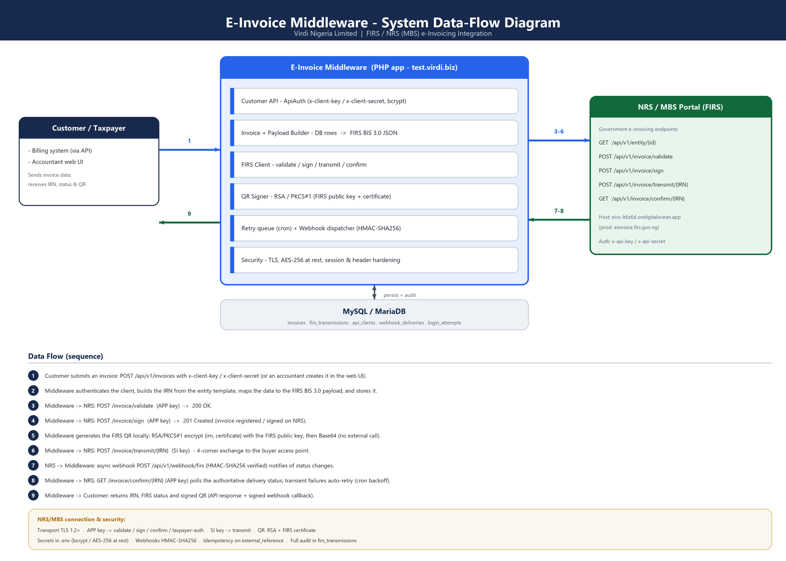
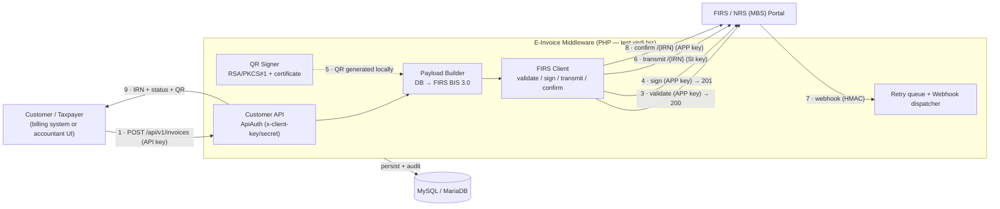

# E-Invoice Middleware — System Architecture

**Virdi Nigeria Limited · FIRS / NRS (MBS) e-Invoicing**
**Version:** 2.1 · **Last updated:** 2026-07-01

> This is the single, consolidated architecture document (the previous
> `docs/ARCHITECTURE.md` has been merged into this file). The full database
> reference, including every column of the `invoices` table, is in
> [`docs/DATABASE.md`](docs/DATABASE.md).

## 1. Overview

The application is a **middleware** between a customer's billing system and the
Nigerian FIRS / NRS e-invoicing portal ("MBS"). Customers (or internal
accountants) create invoices; the middleware builds the IRN, validates, signs,
generates the FIRS QR, transmits to the portal, records every response, tracks
status (via webhooks + confirm polling), and automatically retries anything that
fails for a transient reason.

## 2. Technology Stack

| Layer | Technology |
|-------|------------|
| Language / Runtime | PHP 8.3 |
| Frontend | Server-rendered PHP views + Bootstrap 5 (no SPA framework) |
| API | REST / JSON |
| Database | MySQL / MariaDB (PDO) |
| Web server | Apache (dev / XAMPP), LiteSpeed (production / cPanel) |
| App authentication | PHP sessions + bcrypt password hashing |
| Customer API authentication | API key/secret (`x-client-key` / `x-client-secret`), bcrypt-hashed |
| FIRS authentication | `x-api-key` / `x-api-secret` (APP key + SI key) |
| Encryption | OpenSSL — AES-256-CBC (fields at rest), RSA/PKCS#1 (QR) |
| Webhooks | HMAC-SHA256 signed callbacks |
| Async / queue | Cron-driven retry queue (`retry_transmissions.php`) — no external broker |
| HTTP client | cURL |
| Deployment | cPanel / LiteSpeed, FTP |

## 3. System Data-Flow Diagram (NRS/MBS)



*Figure 1 — The customer/taxpayer submits invoice data to the E-Invoice
Middleware, which builds the FIRS BIS 3.0 document, calls the FIRS/NRS (MBS)
portal through the validate → sign → QR → transmit → confirm pipeline, persists
every step to MySQL, and returns the IRN, status and signed QR.*

The same flow as a diagram source (renders on GitHub):



### 3.1 Data flow (step by step)

1. **Receive** — a customer billing system calls `POST /api/v1/invoices`
   (authenticated with `x-client-key` / `x-client-secret`), or an accountant
   creates the invoice in the web UI.
2. **Build** — the middleware authenticates the caller, builds the **IRN** from
   the entity's template, maps the data to the **FIRS BIS 3.0** payload, and
   persists the invoice (idempotent on the caller's `external_reference`).
3. **Validate** — `POST /api/v1/invoice/validate` on the NRS/MBS portal, using
   the **APP key** → `200 OK`.
4. **Sign** — `POST /api/v1/invoice/sign` (APP key) → `201 Created`; the invoice
   is registered/signed and appears in the taxpayer's NRS account.
5. **QR** — the FIRS QR is generated **locally** per the FIRS QR-code spec: the
   IRN is concatenated with a **UNIX timestamp** (`<irn>.<unix_ts>`), then
   `{ irn: "<irn>.<ts>", certificate }` is RSA/PKCS#1 (v1.5) encrypted with the
   FIRS public key and Base64-encoded (no third-party service).
6. **Transmit** — `POST /api/v1/invoice/transmit/{IRN}` using the **SI key**
   (4-corner exchange to the buyer's access point).
7. **Webhook (async)** — NRS calls back `POST /api/v1/webhook/firs`
   (HMAC-SHA256 verified) on status changes; the event is logged and triggers a
   re-poll rather than being trusted blindly.
8. **Confirm** — `GET /api/v1/invoice/confirm/{IRN}` (APP key) returns the
   authoritative `entry_status` / `delivered`. Transient failures are auto-retried
   by the cron runner with exponential backoff.
9. **Return** — the middleware returns the **IRN, FIRS status and signed QR** to
   the customer (API response + a signed webhook callback to their `webhook_url`).

### 3.2 NRS/MBS connection & security summary

| Aspect | Detail |
|--------|--------|
| NRS/MBS host (sandbox) | `https://eivc-k6z6d.ondigitalocean.app` |
| NRS/MBS host (production) | `https://einvoice.firs.gov.ng` |
| Transport | HTTPS / TLS 1.2+ |
| **APP key** (`x-api-key`/`x-api-secret`) | taxpayer-auth, **validate**, **sign**, **confirm**, download, update, exchange, report |
| **SI key** (`x-api-key`/`x-api-secret`) | **transmit** and other system-integrator actions |
| Customer → middleware auth | `x-client-key` / `x-client-secret` (bcrypt-hashed) |
| Inbound webhook auth | `POST /api/v1/webhook/firs` — HMAC-SHA256 / shared token |
| QR | RSA/PKCS#1 `{irn, certificate}` with the FIRS public key → Base64 |
| At rest | secrets in `.env`; sensitive fields AES-256; full audit in `firs_transmissions` |

## 4. Project Structure

```
[Project Root]/
├── api/                       # Customer-facing REST API
│   ├── index.php              # API front controller (health, invoices, status, inbound webhook)
│   └── .htaccess              # Routes /api/* to index.php
├── includes/                  # Core PHP classes & shared view partials
│   ├── FirsClient.php         # HTTP client for the FIRS/NRS MBS portal (APP/SI key routing)
│   ├── InvoicePayload.php     # DB rows -> FIRS BIS 3.0 JSON (single source of truth)
│   ├── FirsService.php        # Pipeline orchestrator (validate→sign→QR→transmit), retry
│   ├── WebhookDispatcher.php  # HMAC-signed outbound status callbacks
│   ├── ApiAuth.php            # Customer API key/secret auth (bcrypt)
│   ├── Crypto.php             # AES-256-CBC field encryption at rest
│   ├── auth.php               # App user session auth / role gating / brute-force lockout
│   └── header.php, footer.php # Shared UI layout
├── config/                    # Configuration
│   ├── env.php                # .env loader + env() helper
│   └── database.php           # PDO connection (reads DB_* from .env)
├── database/                  # SQL schema & migrations
│   ├── schema.sql             # Base tables
│   ├── migration_firs.sql     # FIRS lifecycle columns
│   ├── migration_webhooks.sql # Webhook/delivery columns
│   ├── migration_invoice_fields.sql / migration_api_payload.sql / migration_firs_invoice_columns.sql
│   ├── migration_login_attempts.sql   # Brute-force protection
│   └── install_cpanel.sql     # Combined one-shot install (schema + all migrations)
├── assets/qrcode.min.js       # Self-hosted QR generator (local QR rendering)
├── docs/                      # DATABASE.md, system-dataflow-diagram.png
├── *.php (root)               # Operator UI & entry points (see below)
├── .env                       # Secrets/config (gitignored, blocked from web)
├── .htaccess                  # Security headers + blocks .env/.sql/includes/config
└── architecture.md            # This document
```

Root PHP pages (operator UI & entry points): `login.php` / `logout.php`,
`dashboard.php`, `invoices.php` / `my_invoices.php`, `create_invoice.php`,
`view_invoice.php`, `customers.php`, `items.php`, `send_to_api.php` (trigger the
FIRS pipeline), `api_docs.php`, `sla.php`, `endpoint_tests.php` (live endpoint
coverage), `provision_api_client.php` (CLI — create API clients),
`retry_transmissions.php` (cron — retries + confirm polls + webhook resends).

## 5. Components

| Layer | Files | Responsibility |
|-------|-------|----------------|
| Config | `config/env.php`, `.env` | Load secrets/config; `.env` blocked from web by `.htaccess`. |
| DB access | `config/database.php` | PDO connection. |
| FIRS client | `includes/FirsClient.php` | Auth headers (APP vs SI key per endpoint), entity lookup, IRN from template, validate/sign/transmit/confirm, RSA QR. |
| Payload mapping | `includes/InvoicePayload.php` | DB rows → verified FIRS BIS 3.0 JSON. Single source of truth for the wire format; never emits empty required fields; enforces HSN format; applies discount as `allowance_charge`. |
| Encryption | `includes/Crypto.php` | AES-256-CBC for fields stored at rest (invoice note). |
| Orchestrator | `includes/FirsService.php` | Pipeline (validate→sign→QR→transmit), logging, status, retry policy; transmits a stored `firs_payload` verbatim when supplied. |
| Retry runner | `retry_transmissions.php` | Cron entry point; re-runs due retries + confirm polls + webhook resends. |
| Customer API | `api/index.php`, `includes/ApiAuth.php` | Accept invoices (simple or full FIRS payload), return status; API-key auth (bcrypt secrets). |
| Webhooks | `api/index.php` (inbound route), `includes/WebhookDispatcher.php` | Receive FIRS push events; send HMAC-signed status callbacks to customers. |
| Auth / security | `includes/auth.php`, `login.php`, `logout.php` | Sessions (regenerated on login, destroyed on logout), role gating, login lockout, CSRF. |
| UI | `create_invoice.php`, `send_to_api.php`, `view_invoice.php`, `api_docs.php`, `sla.php`, `endpoint_tests.php` | Operator screens (server-side priced), docs, SLA, live endpoint coverage. |

## 6. Data Model

The full schema — every table and **every column of the `invoices` table** — is
documented in [`docs/DATABASE.md`](docs/DATABASE.md). Summary of stores:

- **invoices** — invoice header + full FIRS lifecycle (49 columns): base fields,
  the complete FIRS monetary breakdown, lifecycle timestamps/status, the stored
  `firs_payload`, the RSA `qr_data`, and confirm/webhook state. `notes` is
  **encrypted at rest** (AES-256).
- **firs_transmissions** — append-only audit log: one row per portal call
  (`stage`, `attempt`, `http_code`, `status`, full request + response).
- **api_clients** — customer API credentials (`api_key`, bcrypt `api_secret_hash`,
  `webhook_url`, `webhook_secret`).
- **api_inbound_invoices** — invoices received via the API, with the caller's
  `external_reference` for idempotency.
- **firs_webhook_events / webhook_deliveries** — inbound FIRS events and outbound
  customer callbacks.
- **login_attempts** — brute-force protection (per-username lockout).
- **companies / customers / items / invoice_items / users** — master data.

No external cache/broker: retry/confirm work is queued in DB columns
(`next_retry_at`, `transmit_attempts`) and drained by cron.

## 7. Submission Pipeline

1. **Build IRN** from the entity's `irn_template` (e.g.
   `INVxxxx-4BB2353A-20260701`); persisted and reused on every retry.
2. **Validate** — `POST /api/v1/invoice/validate` (APP key). Status → `validated`.
3. **Sign** — `POST /api/v1/invoice/sign` (APP key). Status → `signed`.
4. **QR** — JSON `{irn: "<irn>.<unix_ts>", certificate}` (IRN + UNIX timestamp,
   per the FIRS QR spec) → RSA/PKCS#1 encrypt with the FIRS public key → base64.
   Stored in `qr_data`, rendered locally on the invoice.
5. **Transmit** — `POST /api/v1/invoice/transmit/{IRN}` (SI key). On success → `transmitted`.

Stage gating uses the persisted timestamps, so a retry resumes at the failed
stage and never repeats a non-idempotent step (re-signing returns HTTP 400).

## 8. Status Reporting & Webhooks

FIRS transmission is asynchronous (4-corner exchange model), so final status
arrives after the transmit call returns. The app captures it two ways:

- **Inbound push** — `POST /api/v1/webhook/firs` receives FIRS events (logged in
  `firs_webhook_events`, authenticated by `FIRS_WEBHOOK_SECRET` HMAC/token). A push
  never changes state on its own; it triggers a re-poll of `confirm`.
- **Confirm poll** — `GET /api/v1/invoice/confirm/{IRN}` returns the authoritative
  `entry_status` / `transmitted` / `delivered`. Polled on transmit and swept by the
  cron for transmitted-but-undelivered invoices.

On any change the app calls the customer's `webhook_url` (HMAC-SHA256 signed via
their `webhook_secret`, header `x-webhook-signature`), with retry/backoff logged
in `webhook_deliveries`.

## 9. Retry Policy

A failure is **transient** (→ queued, exponential backoff 2/5/15/60/180 min,
max 6 attempts) when it is a network error, HTTP ≥ 500, or the message contains
`offline / timeout / unavailable / temporarily / try again`. Everything else is
a **permanent** business rejection — surfaced immediately, not retried. The cron
job `retry_transmissions.php` drains the due queue.

## 10. External Integrations

**FIRS / NRS (MBS) e-invoicing portal** — government e-invoice validation,
signing, transmission and status confirmation. Integration method: REST/JSON with
`x-api-key` / `x-api-secret` header auth, using the APP key for
validate/sign/confirm and the SI key for transmit (see §3.2).

## 11. Security

- HTTPS/TLS for all portal traffic.
- FIRS credentials in `.env`, denied web access via `.htaccess`; internal
  `includes/` and `config/` PHP blocked from direct access.
- Customer API secrets and user passwords stored as **bcrypt** hashes only.
- Sensitive invoice fields (`notes`) encrypted at rest with **AES-256-CBC**.
- QR payloads RSA-encrypted with the FIRS public key per the QR-code spec;
  generated locally (never sent to a third-party service).
- Inbound/outbound webhooks authenticated by HMAC-SHA256.
- **Login hardening:** session regenerated on login and destroyed on logout;
  per-username lockout after 5 failures / 15 min; CSRF token on the login form.
- **Browser security headers** (`.htaccess`): HSTS, X-Frame-Options: DENY, CSP,
  Referrer-Policy, Permissions-Policy; session cookie `HttpOnly; Secure; SameSite=Strict`.
- Server-side pricing: invoice financials recomputed from the catalogue (client
  price fields are never trusted); idempotency keys prevent duplicate submissions.

## 12. Deployment & Infrastructure

- **Hosting:** shared cPanel (LiteSpeed); FIRS portal is external.
- **Services:** LiteSpeed/Apache, MySQL/MariaDB, PHP 8.3, cron.
- **Deploy:** upload the app to the document root; import
  `database/install_cpanel.sql` (complete schema) or `schema.sql` + migrations in
  order; set real values in `.env` (`FIRS_APP_*`, `FIRS_SI_*`, `FIRS_BUSINESS_ID`,
  `FIRS_ENTITY_ID`, `FIRS_PUBLIC_KEY`, `FIRS_CERTIFICATE`, `DB_*`).
- **Cron:** `*/5 * * * * php /home/USER/public_html/.../retry_transmissions.php`.
- **Provision** customer API clients with `provision_api_client.php`.
- **Monitoring:** append-only `firs_transmissions` audit log; `webhook_deliveries`
  log; admin `endpoint_tests.php` live coverage page.

## 13. Development & Testing

- **Local setup:** XAMPP (Apache + MariaDB + PHP 8.3); import
  `database/install_cpanel.sql`; set `.env` (`FIRS_*` and `DB_*`).
- **Testing:** live endpoint coverage via `endpoint_tests.php` (admin-only)
  exercising every FIRS endpoint and the app's own APIs.
- **Security:** independently assessed by penetration test (VPAT) — all findings
  remediated.

## 14. Verification Status (sandbox)

| Endpoint | Result |
|----------|--------|
| `GET /api` health | ✅ 200 `{healthy:true}` |
| `GET /api/v1/entity/{id}` | ⚠️ 403 for SI keys (entity read restricted; not required) |
| `POST /api/v1/invoice/validate` | ✅ 200 `{ok:true}` (APP key) |
| `POST /api/v1/invoice/sign` | ✅ 201 `{ok:true}` (APP key) — invoices appear in the NRS portal |
| QR signing (RSA/PKCS#1) | ✅ generated locally, rendered on the invoice |
| `POST /api/v1/invoice/transmit/{IRN}` | ⚠️ pending FIRS authorisation of the SI/entity for transmit |
| Customer API (accept/status/idempotency/auth) | ✅ verified live |

## 15. Roadmap

- Transmit go-live depends on FIRS enabling the SI/entity transmit access.
- Optional: move the DB-backed retry queue to a dedicated worker if volume grows.

## 16. Project Identification

- **Project:** FIRS / NRS E-Invoice Middleware — Virdi Nigeria Limited (TIN 22047671-0001)
- **Repository:** github.com/Highscoretech/invoice-generation (private)
- **Team:** Highscoretech
- **Environment:** test.virdi.biz

## 17. Glossary

- **FIRS** — Federal Inland Revenue Service (Nigeria).
- **NRS / MBS** — Nigeria Revenue Service / Merchant Buyer Solution (the e-invoicing portal).
- **IRN** — Invoice Reference Number, built from the entity's IRN template.
- **BIS 3.0** — the invoice document format accepted by the FIRS portal.
- **APP key / SI key** — the two FIRS credential sets (application vs system-integrator).
- **QR** — signed QR payload: RSA-encrypted `{irn, certificate}`, base64-encoded.
