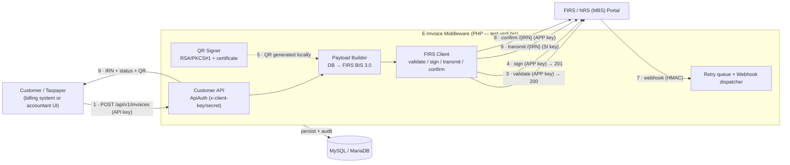

# E-Invoice Middleware — System Architecture

**Version:** 2.0 (FIRS integration)
**Last updated:** 2026-06-02

## 1. Purpose

The application is a **middleware** between a customer's billing system and the
Nigerian FIRS / NRS e-invoicing portal ("MBS"). Customers (or internal
accountants) create invoices; the middleware builds the IRN, validates, signs,
generates the FIRS QR, transmits to the portal, records every response, tracks
status, and automatically retries anything that fails for a transient reason.

*Figure 1 — System data-flow: the customer/taxpayer submits invoice data to the
E-Invoice Middleware, which builds the FIRS BIS 3.0 document, calls the FIRS/NRS
(MBS) portal through the validate → sign → QR → transmit → confirm pipeline,
persists every step to MySQL, and returns the IRN, status and signed QR.*

The same flow as a diagram source (renders on GitHub):

### 1.1 Data flow & NRS/MBS connection (step by step)

1. **Receive** — a customer billing system calls `POST /api/v1/invoices`
   (authenticated with `x-client-key` / `x-client-secret`), or an accountant
   creates the invoice in the web UI.
2. **Build** — the middleware authenticates the caller, builds the **IRN** from
   the entity's template, maps the data to the **FIRS BIS 3.0** payload, and
   persists the invoice (idempotent on the caller's `external_reference`).
3. **Validate** — `POST /api/v1/invoice/validate` on the NRS/MBS portal, using
   the **APP key** → `200 OK`.
4. **Sign** — `POST /api/v1/invoice/sign` (APP key) → `201 Created`; the invoice
   is registered/signed and appears in the taxpayer's NRS account.
5. **QR** — the FIRS QR is generated **locally**: RSA/PKCS#1-encrypt
   `{ irn, certificate }` with the FIRS public key, then Base64 (no third party).
6. **Transmit** — `POST /api/v1/invoice/transmit/{IRN}` using the **SI key**
   (4-corner exchange to the buyer's access point).
7. **Webhook (async)** — NRS calls back `POST /api/v1/webhook/firs`
   (HMAC-SHA256 verified) on status changes; the event is logged and triggers a
   re-poll rather than being trusted blindly.
8. **Confirm** — `GET /api/v1/invoice/confirm/{IRN}` (APP key) returns the
   authoritative `entry_status` / `delivered`. Transient failures are auto-retried
   by the cron runner with exponential backoff.
9. **Return** — the middleware returns the **IRN, FIRS status and signed QR** to
   the customer (API response + a signed webhook callback to their `webhook_url`).

**Connection & security summary**

| Aspect | Detail |
|--------|--------|
| NRS/MBS host (sandbox) | `https://eivc-k6z6d.ondigitalocean.app` |
| NRS/MBS host (production) | `https://einvoice.firs.gov.ng` |
| Transport | HTTPS / TLS 1.2+ |
| **APP key** (`x-api-key`/`x-api-secret`) | taxpayer-auth, **validate**, **sign**, **confirm**, download, update, exchange, report |
| **SI key** (`x-api-key`/`x-api-secret`) | **transmit** and other system-integrator actions |
| Customer → middleware auth | `x-client-key` / `x-client-secret` (bcrypt-hashed) |
| Inbound webhook auth | `POST /api/v1/webhook/firs` — HMAC-SHA256 / shared token |
| QR | RSA/PKCS#1 `{irn, certificate}` with the FIRS public key → Base64 |
| At rest | secrets in `.env`; sensitive fields AES-256; full audit in `firs_transmissions` |

## Technology Stack

| Layer | Technology |
|-------|------------|
| Language / Runtime | PHP 8.3 |
| Frontend | Server-rendered PHP views + Bootstrap 5 (no SPA framework) |
| API | REST / JSON |
| Database | MySQL / MariaDB (PDO) |
| Web server | Apache (dev / XAMPP), LiteSpeed (production / cPanel) |
| App authentication | PHP sessions + bcrypt password hashing |
| Customer API authentication | API key/secret (`x-client-key` / `x-client-secret`), bcrypt-hashed |
| FIRS authentication | `x-api-key` / `x-api-secret` headers |
| Encryption | OpenSSL — AES-256-CBC (fields at rest), RSA/PKCS#1 (QR) |
| Webhooks | HMAC-SHA256 signed callbacks |
| Async / queue | Cron-driven retry queue (`retry_transmissions.php`) |
| HTTP client | cURL |
| Deployment | cPanel / LiteSpeed, FTP |

## 2. Components

| Layer | Files | Responsibility |
|-------|-------|----------------|
| Config | `config/env.php`, `.env` | Load secrets/config; `.env` blocked from web by `.htaccess`. |
| DB access | `config/database.php` | PDO connection. |
| FIRS client | `includes/FirsClient.php` | Auth headers, entity lookup, IRN from template, validate/sign/transmit, RSA QR. |
| Payload mapping | `includes/InvoicePayload.php` | DB rows → verified FIRS BIS 3.0 JSON. Single source of truth for the wire format. Never emits empty required fields; enforces HSN format; applies discount as `allowance_charge`. |
| Encryption | `includes/Crypto.php` | AES-256-CBC for fields stored at rest (invoice note). |
| Orchestrator | `includes/FirsService.php` | Pipeline (validate→sign→QR→transmit), logging, status, retry policy. |
| Retry runner | `retry_transmissions.php` | Cron entry point; re-runs due retries + confirm polls + webhook resends. |
| Customer API | `api/index.php`, `includes/ApiAuth.php` | Accept invoices, return status; API-key auth (bcrypt secrets). |
| Webhooks | `api/index.php` (inbound route), `includes/WebhookDispatcher.php` | Receive FIRS push events; send HMAC-signed status callbacks to customers. |
| Provisioning | `provision_api_client.php` | Create API clients (CLI). |
| UI | `send_to_api.php`, `view_invoice.php`, `api_docs.php`, `sla.php`, `endpoint_tests.php` | Operator screens, docs, SLA, live endpoint coverage. |

## 3. Data model (additions)

- **invoices** — added:
  - *FIRS lifecycle*: `irn`, `business_id`, `qr_data` (RSA QR payload),
    `firs_status` (`not_sent → validated → signed → transmitted | failed |
    queued_retry`), `validated_at`, `signed_at`, `transmitted_at`,
    `transmit_attempts`, `last_attempt_at`, `next_retry_at`, `last_error`,
    `delivered`, `entry_status`, `confirmed_at`.
  - *Payload fields* (so each invoice stores everything needed to build the
    submission): `invoice_type_code` (default 381), `payment_status`
    (PENDING), `document_currency_code` (NGN), `tax_point_date`,
    `discount_rate` (with the existing `discount_amount`).
  - `notes` is **encrypted at rest** (AES-256) via `Crypto`, decrypted only when
    building the payload / displaying.
- **firs_transmissions** — append-only audit log: one row per portal call
  (`stage`, `attempt`, `http_code`, `status`, full request + response).
- **api_clients** — customer API credentials (`api_key`, bcrypt `api_secret_hash`,
  optional `webhook_url`).
- **api_inbound_invoices** — invoices received via the API, with the caller's
  `external_reference` for idempotency.

## 4. Submission pipeline

1. **Build IRN** from the entity's `irn_template` (e.g.
   `INVxxxx-5AF9E02D-20260602`); persisted and reused on every retry.
2. **Validate** — `POST /api/v1/invoice/validate`. Stored, status → `validated`.
3. **Sign** — `POST /api/v1/invoice/sign`. Status → `signed`.
4. **QR** — JSON `{irn, certificate}` → RSA/PKCS#1 encrypt with FIRS public key →
   base64. Stored in `qr_data`, rendered on the invoice.
5. **Transmit** — `POST /api/v1/invoice/transmit/{IRN}`. On success → `transmitted`.

Stage gating uses the persisted timestamps, so a retry resumes at the failed
stage and never repeats a non-idempotent step (re-signing returns HTTP 400).

## 4a. Status reporting & webhooks

FIRS transmission is asynchronous (4-corner exchange model), so final status
arrives after the transmit call returns. The app captures it two ways:

- **Inbound push** — `POST /api/v1/webhook/firs` receives FIRS events (logged in
  `firs_webhook_events`, authenticated by `FIRS_WEBHOOK_SECRET` HMAC/token). A push
  never changes state on its own; it triggers a re-poll of `confirm`.
- **Confirm poll** — `GET /api/v1/invoice/confirm/{IRN}` returns the authoritative
  `entry_status` / `transmitted` / `delivered`. Polled on transmit and swept by the
  cron for transmitted-but-undelivered invoices. Works even where FIRS cannot reach
  our inbound URL (e.g. local testing).

On any change we call the customer's `webhook_url` (HMAC-SHA256 signed via their
`webhook_secret`, header `x-webhook-signature`), with retry/backoff logged in
`webhook_deliveries`.

## 5. Retry policy

A failure is **transient** (→ queued, exponential backoff 2/5/15/60/180 min,
max 6 attempts) when it is a network error, HTTP ≥ 500, or the message contains
`offline / timeout / unavailable / temporarily / try again`. Everything else is
a **permanent** business rejection — surfaced immediately, not retried. The cron
job `retry_transmissions.php` drains the due queue.

## 6. Security

- HTTPS/TLS for all portal traffic.
- FIRS credentials in `.env`, denied web access via `.htaccess`; internal
  `includes/` and `config/` PHP blocked from direct access.
- Customer API secrets and user passwords stored as **bcrypt** hashes only.
- Sensitive invoice fields (note) encrypted at rest with **AES-256-CBC** (`Crypto`).
- QR payloads RSA-encrypted with the FIRS public key per the QR-code spec.
- Inbound/outbound webhooks authenticated by HMAC-SHA256 (shared secret).
- Idempotency keys prevent duplicate submissions.

## 7. Deployment (cPanel)

1. Upload the app to the domain's document root.
2. Import `database/install_cpanel.sql` (complete schema), or apply
   `schema.sql` then the migrations in order.
3. Set real values in `.env` (`FIRS_API_KEY`, `FIRS_API_SECRET`,
   `FIRS_BUSINESS_ID`, `FIRS_ENTITY_ID`, `DB_*`).
4. Add cron: `*/5 * * * * php /home/USER/public_html/einvoice/retry_transmissions.php`.
5. Provision customer API clients with `provision_api_client.php`.

## 8. Verification status (2026-06-02, sandbox)

| Endpoint | Result |
|----------|--------|
| `GET /api` health | ✅ 200 `{healthy:true}` |
| `GET /api/v1/entity/{id}` | ✅ 200 (business id + irn_template resolved) |
| `POST /api/v1/invoice/validate` | ✅ 200 `{ok:true}` |
| `POST /api/v1/invoice/sign` | ✅ 201 `{ok:true}` |
| `POST /api/v1/invoice/transmit/{IRN}` | ⚠️ portal access points offline in sandbox → exercised retry path |
| Customer API (accept/status/idempotency/auth) | ✅ verified locally |
